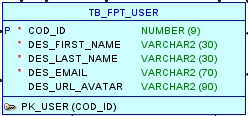

<h1>Health-app API</h1>

O objetivo dessa API é servir a aplicação Health-app

 

<table>
<tr>
	<th>Status do Projeto</th>
</tr>
<tr>
	<td>&#128296 &#128295 &#129691 Em construção...</td>
</tr>
</table>

 

<table>
<tr>
	<th>Features</th>
</tr>
<tr>
	<td>&#128994 Cadastrar Usuario</td>
</tr>

<tr>
	<td>&#128992 Buscar informações pelo e-mail cadastrado</td>
</tr>
<tr>
	<td>&#128992 Criar evento </td>
</tr>
<tr>
	<td>&#128992 Excluir um evento criado</td>
</tr>
<tr>
	<td>&#128992 Participar de um evento criado</td>
</tr>
</table>

 

<h3 >Diagrama ER</h3>

 

<h3 >Requisitos</h3>
<table>
<tr>
	<th>Ferramenta</th>
	<th>Versão</th>
</tr>
<tr>
	<td>IntelliJ</td>
	<td>Community</td>
</tr>
<tr>
	<td>Java JDK</td>
	<td>17</td>
</tr>
<tr>
	<td>MySQL</td>
	<td>8.**</td>
</tr>
<tr>
	<td>Gradle</td>
	<td>7.**</td>
</tr>
<tr>
	<td>Postman</td>
	<td>9.**</td>
</tr>
</table>

 

<h3>Tecnologias Utilizadas</h3>

<table>
<tr>
	<th>&#9881 Dependência</th>
	<th>Versão</th>
</tr>
<tr>
	<td>Spring Initialzr</td>
	<td><a style="text-decoration:none" href="https://start.spring.io/">Start Spring</a></td>
</tr>
<tr>
	<td>spring-boot-starter-web</td>
	<td>3.0.4</td>
</tr>
<tr>
	<td>spring-boot-starter-data-jpa</td>
	<td>3.0.4</td>
</tr>
<tr>
	<td>mysql-connector-j</td>
	<td>8.0.32</td>
</tr>
</table>

 

<h3>Implementação</h3>
<ul>
    <li>Configure o MySQL em sua maquina com o usuário denominado <b>root</b>  e com o endereço <b>localhost:3306</b>, caso contrário algumas alterações deverão ser realizadas no arquivo de configuração do gradle <b>application.properties</b>;</li>
    <li>Crie um banco de dados no MySQL e as tabelas que constam no arquivo <b>mvp_sql.txt </b> localizado na pasta <b>database</b> desse projeto;</li>
    <li>Faça a inserção de teste que também consta no arquivo mencionado anteriormente;</li>
    <li>Com o repositório clonado em seu ambiente local, garanta que todas as dependencias necessárias estão no arquivo <b>build.gradle.kts</b> e que as configurações para o acesso ao banco de dados no arquivo <b>application.properties</b> estão condizentes com o banco instalado em sua maquina;</li>
    <li>Depois que o ambiente estiver configurado, rode a classe main do projeto denominada <b>MainApplication</b> para que o servidor inicie;</li>
    <li>Nesse projeto o Tomcat foi configurado para escutar as requisições da porta <b>:8081</b>, para realizar os testes com o Postman configure as requisições para a porta mancionada anteriormente juntamente com os end-points nas classes do package <b>controllers</b>;</li>
</ul>